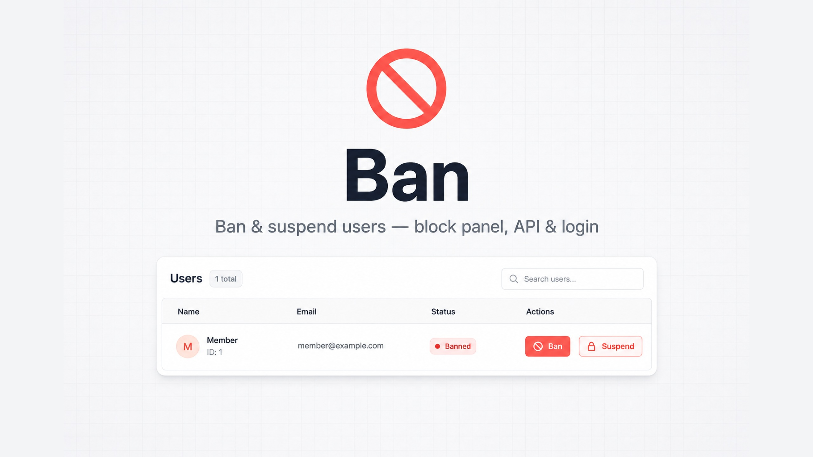
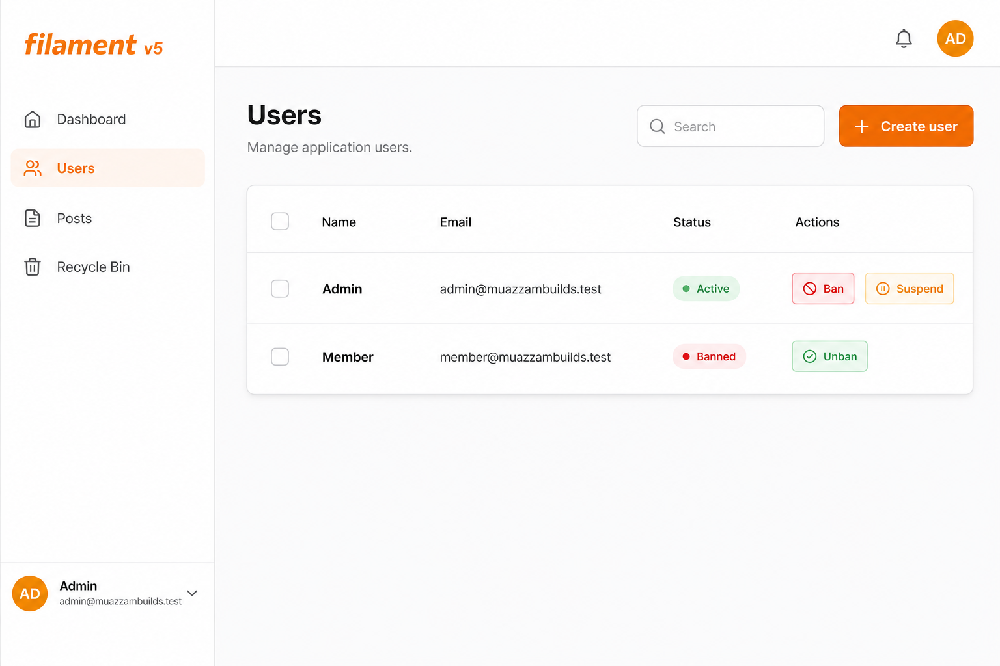

<p align="center" class="filament-hidden">
  
</p>

# Filament Ban

Ban and suspend users from **Filament v5**. Add actions to your user resource; middleware blocks the panel, API, and login when an account is banned or suspended.

<p align="center">
  
</p>

## Requirements

| Dependency | Version |
|---|---|
| PHP | `^8.2` |
| Laravel | `^11` / `^12` |
| Filament | `^5.0` |

## Installation

```bash
composer require muazzambuilds/filament-ban
```

Publish the config and migration:

```bash
php artisan vendor:publish --tag=filament-ban-config
php artisan vendor:publish --tag=filament-ban-migrations
php artisan migrate
```

## Setup

### 1. Add the trait to your user model

```php
use MuazzamBuilds\FilamentBan\Concerns\Bannable;

class User extends Authenticatable
{
    use Bannable;
}
```

### 2. Register the panel plugin

```php
use MuazzamBuilds\FilamentBan\BanPlugin;

public function panel(Panel $panel): Panel
{
    return $panel
        ->plugin(BanPlugin::make());
}
```

This attaches auth middleware so banned / suspended users cannot use the panel (and are logged out).

### 3. Protect API routes

```php
Route::middleware(['auth:sanctum', 'banned'])->group(function () {
    // …
});
```

Login is blocked automatically via Laravel’s `Validated` auth event — no custom login page required.

### 4. Add actions to your user resource

```php
use MuazzamBuilds\FilamentBan\Actions\BanAction;
use MuazzamBuilds\FilamentBan\Actions\SuspendAction;
use MuazzamBuilds\FilamentBan\Actions\UnbanAction;
use MuazzamBuilds\FilamentBan\Actions\UnsuspendAction;

public function getRecordActions(): array
{
    return [
        BanAction::make(),
        UnbanAction::make(),
        SuspendAction::make(),
        UnsuspendAction::make(),
    ];
}
```

Or on a table:

```php
->recordActions([
    BanAction::make(),
    UnbanAction::make(),
    SuspendAction::make(),
    UnsuspendAction::make(),
])
```

## Behaviour

| State | Effect |
|---|---|
| **Banned** (`banned_at` set) | Permanent block until unbanned |
| **Suspended** (`suspended_until` in the future) | Temporary block; lifts automatically when the time passes |

Blocked users:

- Cannot log in (validation error with ban/suspend message)
- Are rejected from Filament panels (plugin middleware)
- Are rejected from routes using the `banned` middleware (API-friendly JSON 403)

## Model API

```php
$user->ban('Spam');
$user->unban();
$user->suspend(now()->addDays(7), 'Cool down');
$user->unsuspend();

$user->isBanned();
$user->isSuspended();
$user->isAccessBlocked();
```

Query scopes: `User::banned()`, `User::notBanned()`, `User::suspended()`, `User::accessBlocked()`.

## Config

```php
// config/filament-ban.php
'user_model' => 'App\\Models\\User',
'logout' => true,
'api_status' => 403,
'web_redirect' => null, // route name or path; null throws AuthenticationException
```

## License

MIT
